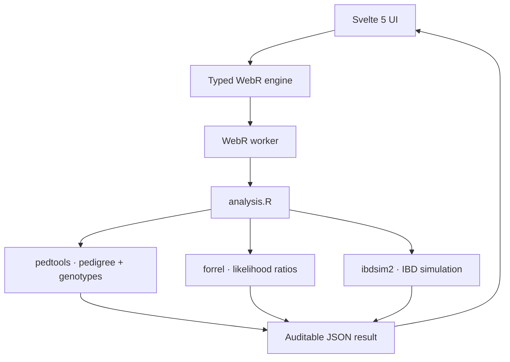

# DNA Evidence Explorer — WebR proof of concept

This repository is a runnable research demonstrator for browser-local pedigree analysis. It uses the real R packages `pedtools`, `forrel`, and `ibdsim2` through WebR. It does not reimplement their statistical methods in TypeScript.

The app accepts a local CSV or TSV STR profile table with columns `sample,locus,allele_1,allele_2`. It currently compares exactly two samples. The bundled walkthrough is the documented sibling example from the `forrel` project; it is a reproducible teaching fixture, not a measured casework sample. Imported files are processed in the browser and are not uploaded.

The included test case:

1. Builds a full-sibling pedigree for synthetic people A and B with `pedtools`.
2. Simulates a configurable synthetic marker panel.
3. Uses `forrel` to compare full-sibling and half-sibling hypotheses with an unrelated-pair reference.
4. Uses `ibdsim2` and the decode19 recombination map to simulate IBD sharing on chromosome 1.
5. Returns structured JSON to Svelte for an interactive pedigree, marker-level LR view, chromosome map, and simulation distribution.

This is a proof of concept. It is not validated for forensic casework, identification, or legal reporting.

## Run it locally

Requirements:

- Node.js 22 or newer
- pnpm 10 or newer
- A current Chromium or Firefox browser
- Internet access to `https://repo.r-wasm.org` on first use

```bash
pnpm install
pnpm dev
```

Open the local URL printed by Vite, normally `http://localhost:5173`.

## GitHub Pages deployment

The workflow at `.github/workflows/deploy-pages.yml` builds and deploys the app on pushes to `main`. In the repository settings, set **Pages → Source** to **GitHub Actions**. The workflow uses the repository name as the project-site base path, so WebR and bundled profile files resolve correctly at `https://<owner>.github.io/<repository>/`.

For a custom domain, copy `public/CNAME.example` to `public/CNAME`, replace its contents with the domain you control, and commit it. Add the DNS records required by GitHub Pages, then set the same domain under **Pages → Custom domain**. A custom-domain build should use `VITE_BASE_PATH=/` if you build manually; the committed `CNAME` file is what tells Pages to retain the domain configuration.

Click **Run test case**. On the first run, WebR downloads compiled package binaries and their dependencies. This can take a minute or more. Further runs in the same tab reuse the active R session and are much faster.

To make a production build:

```bash
pnpm check
pnpm test
pnpm build
pnpm preview
```

The Vite build copies WebR's R runtime into `dist/webr`, so the R runtime itself is served by your app. Scientific R packages are installed at runtime from the official WebR binary repository.

## Concrete architecture



| Layer | File | Responsibility |
|---|---|---|
| UI orchestration | `src/App.svelte` | Parameters, progress, errors, result composition |
| Scientific bridge | `src/lib/webr-engine.ts` | Initialize WebR, install packages, call R, parse the result |
| R analysis | `public/r/analysis.R` | All pedigree, LR, recombination, and serialization work |
| Visual components | `src/components/` | Pedigree, chromosome, and locus-level evidence views |
| Contracts | `src/lib/types.ts` | TypeScript boundary for analysis inputs and outputs |
| Runtime assets | `vite.config.ts` | Copy WebR's Wasm runtime into the built app |

The UI never constructs arbitrary R code from text. It validates bounded integer inputs and calls one predefined R function. No DNA or case data is uploaded by this proof of concept.

## Test case details

- **Observed scenario:** A and B are simulated as full siblings.
- **Alternative hypotheses:** full siblings, half siblings, and unrelated.
- **Marker model:** 3–30 synthetic, unlinked, STR-style markers with eight equally available allele labels. These are educational markers, not a named forensic kit or population frequency database.
- **IBD model:** chromosome 1 from the decode19 map included with `ibdsim2`.
- **Reproducibility:** the chosen integer seed drives both profile and IBD simulation.

The LR is a ratio between explicit hypotheses. It is not a probability that a relationship is true. A negative marker-level `log10(LR)` means that marker supports the unrelated reference over the full-sibling hypothesis.

## Important next steps before real research use

1. Replace the synthetic marker model with a versioned, documented population-frequency dataset.
2. Add schema-validated import for research data, plus explicit consent and retention controls.
3. Store input hashes, exact package versions, parameters, seeds, and exported result manifests.
4. Add independent golden-file comparisons against native R runs.
5. Define and execute a validation plan before using any result outside education or software research.
6. Add sensitivity views for population model, mutation rate, marker selection, and alternative pedigrees.

## Troubleshooting

- **The first run stays on “Loading genetics packages”:** confirm that `repo.r-wasm.org` is allowed by your network or content blocker.
- **A service worker or shared-memory error appears:** this project forces WebR's `PostMessage` channel, so it does not require cross-origin isolation headers. Reload after clearing an older dev build.
- **The app works in development but not under a subpath:** set Vite's `base` option for the deployment path. Runtime assets use `import.meta.env.BASE_URL` and follow that setting.
- **Package installation fails after a WebR upgrade:** the WebR runtime and binary repository must support the same R minor version. Keep the pinned `webr` version until the corresponding repository is available.

## Licenses

This repository's original UI and bridge code are provided under the MIT license. The installed R packages retain their own licenses. `pedtools` and `ibdsim2` are GPL-3; `forrel` is GPL-2 or later. Review those licenses before redistribution.
